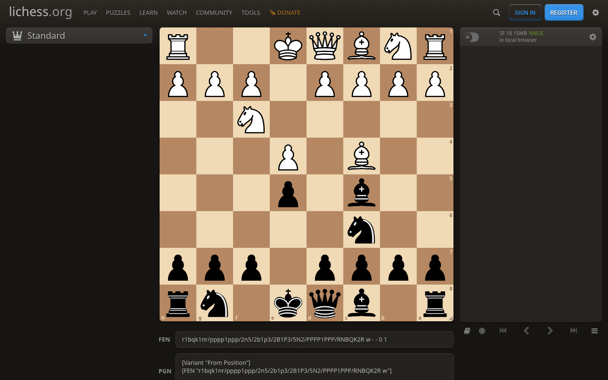

# fenshot

**Screenshot in. FEN out.**

[](https://github.com/scoriiu/fenshot/actions/workflows/ci.yml)
[](https://www.npmjs.com/package/@scoriiu/fenshot)
[](LICENSE)

Paste any chessboard screenshot, a chess.com game, a Lichess puzzle, a diagram from a chess book, a position from a reddit thread, and get the position as a FEN, entirely in your browser. No account, no upload, nothing leaves the page.

**[Try it live →](https://scoriiu.github.io/fenshot/)**

## How it works

| Your screenshot | | What fenshot reads |
|:---:|:---:|:---:|
|  | **→** | `r1bqk1nr/pppp1ppp/2n5/`<br/>`2b1p3/2B1P3/5N2/`<br/>`PPPP1PPP/RNBQK2R` |

The screenshot above is from **Black's point of view**; fenshot detects that from pawn-advance direction and flips the read automatically. One click later the position is open on [Lichess analysis](https://lichess.org/analysis) or the board editor.

Under the hood:

1. **Board detection** finds the board in the image via gradient peak analysis, a TypeScript port of `chessboard_finder.py` from [tensorflow_chessbot](https://github.com/Elucidation/tensorflow_chessbot) (MIT).
2. **Tile classification** reads the 64 squares with a compact CNN (~330k params, 1.3 MB ONNX) running on onnxruntime-web, WASM in the browser.
3. **Alignment arbitration** classifies both the detected corners and a checkerboard grid-snap candidate; the read with higher mean confidence wins. This is what makes book diagrams work.
4. **Orientation resolution** detects Black-point-of-view screenshots from pawn-advance direction and flips the read.
5. **Honesty contract**: every result carries per-tile confidence. Unreliable reads say so instead of returning a silently wrong FEN.

### Why the classifier is different

The classic open-source model (tensorflow_chessbot) was trained on a narrow theme set: it confuses queens and kings on chess.com themes and cannot read book diagrams. fenshot's classifier was trained **from scratch on a fully synthetic corpus**: known positions rendered across ~72 piece sets and ~55 board themes, plus procedural flat boards and hatched book-diagram styles, with real-world degradations baked in (JPEG artifacts, blur, dimming overlays, resize round-trips, corner jitter). Every tile's label is true by construction, and training tiles flow through the exact same extraction code that runs in production, zero train/serve skew.

On the real-screenshot eval set, the legacy model misread up to 34 tiles per board. fenshot ships at **zero wrong tiles on every positive case**, with negatives (no board in the image) still correctly rejected.

## Use it as a library

The recognition engine is published as [`@scoriiu/fenshot` on npm](https://www.npmjs.com/package/@scoriiu/fenshot):

```bash
npm install @scoriiu/fenshot onnxruntime-web
```

```ts
import { createRecognizer, resolveOrientation, placementToFen } from "@scoriiu/fenshot";

const recognizer = createRecognizer({
  modelUrl: "/models/chess-tiles-v2.onnx",   // shipped in the package under model/
  wasmPaths: "/ort/",                        // onnxruntime-web wasm assets
});

const result = await recognizer.recognize(file); // File | Blob | HTMLImageElement | ImageBitmap
if (result?.reliable) {
  const { placement } = resolveOrientation(result.placement);
  console.log(placementToFen(placement, "w"));
}
```

Full API docs, asset-serving notes, and bundler specifics: [packages/fenshot/README.md](packages/fenshot/README.md).

## Repo layout

| Path | What |
|------|------|
| `packages/fenshot` | The npm package: detection, classification, FEN composition, golden regression tests |
| `apps/web` | The demo app (Vite + React), deployed to GitHub Pages |

## Development

```bash
npm install
npm test              # golden regression suite (29 tests, real screenshots)
npm run build         # build the package
npm run dev           # run the demo app
```

The test suite includes golden fixtures produced by the python reference pipeline and real screenshots with known FENs; the detector, the tile tensors, and the end-to-end reads are all locked.

## Credits

- Board detection algorithm: [Elucidation/tensorflow_chessbot](https://github.com/Elucidation/tensorflow_chessbot) (MIT).
- Piece sets and board themes used as training input: lichess ([lila](https://github.com/lichess-org/lila), free licenses). The corpus also includes other sites' themes so the recognizer reads their screenshots too; those assets are training input only and are never redistributed, only trained weights ship.
- Board rendering in the demo: [cm-chessboard](https://github.com/shaack/cm-chessboard) (MIT).
- Built and maintained by [coachess.app](https://coachess.app), fenshot is the open-sourced position-import engine that runs there in production.

## License

[MIT](LICENSE)
